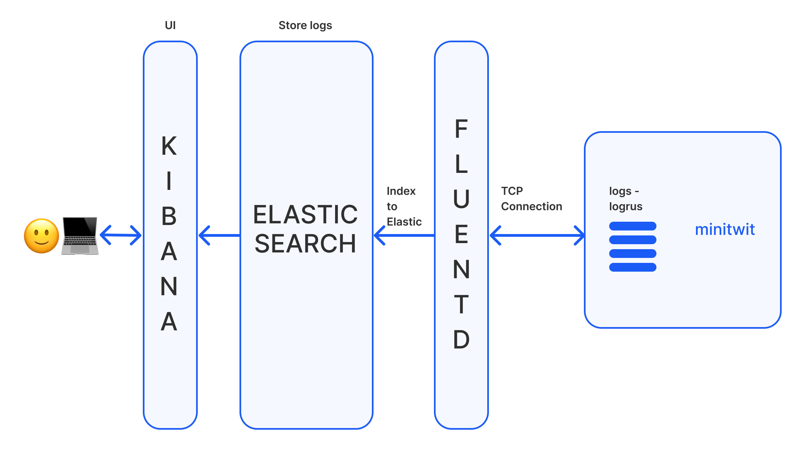

# ITU Minitwit


---
## Table of Contents
- [ITU Minitwit](#itu-minitwit)
  - [Table of Contents](#table-of-contents)
    - [Intro](#intro)
    - [Setup for Local Development](#setup-for-local-development)
    - [Getting Started](#getting-started)
    - [Version Control](#version-control)
    - [Pre-requisites](#pre-requisites)
    - [Logging System with EFK Stack](#logging-system-with-efk-stack)

---
### Intro
- Not included yet

---
### Setup for Local Development

### Getting Started

### Version Control
We use [Github Flow]((https://docs.github.com/de)), so all code changes happen through pull requests.
1. Clone the repo and create a new branch from the release branch.
2. Branches are named with the following convention: `fix/fix-name` or `feature/feature-name` for
more information please visit [Naming conventions for Git](https://medium.com/@abhay.pixolo/naming-conventions-for-git-branches-a-cheatsheet-8549feca2534)
3. For commit messages we use the following convention:
```
feat: add hat wobble
^--^  ^------------^
|     |
|     +-> Summary in present tense.
|
+-------> Type: chore, docs, feat, fix, refactor, style, or test.
```
For more information please visit [Semantic Commit Messages](https://gist.github.com/joshbuchea/6f47e86d2510bce28f8e7f42ae84c716)

### Pre-requisites
We recommend setting up a virtual environment for local development to 
manage dependencies and to keep your system's Python environment clean. 
Here's how to do it:

1. Open your terminal and navigate to the itu-minitwit` project directory:
   ```
   cd itu-minitwit
   ```
2. Create a virtual environment named venv` within the project folder by executing:`
   ```
   python3 -m venv venv
   ```
3. Activate the virtual environment with the following command:
   ```
   source venv/bin/activate
   ```
   (Note: On Windows, the activation command is venv\Scripts\activate)
4. Install all the necessary packages specified in the requirements.txt` file using pip:
   ```
   pip install -r requirements.txt
   ```
    
We've included a .gitignore file that excludes the venv directory from version control. 
This prevents the environment folder from being pushed to the production repository, 
avoiding potential conflicts and keeping the repository clean.

### Logging System with EFK Stack

Our application, Minitwit, implements a logging system to ensure efficient tracking, monitoring, and analysis of its data. Below is the overview of our logging architectur and how to use logs. The below graphic presents an overview of our efk stack architecture.



**Components:**
* **Minitwit:** Our main application, which generates logs via Logrus.
* **Logrus:** A structured logger for Go, responsible for generating coherent and structured logs.
* **Fluentd:** A data collector that aggregates logs from various sources and forwards them to Elasticsearch.
* **Elasticsearch:** A search and analytics engine that indexes and stores our log data.
* **Kibana:** A visualization tool that interfaces with Elasticsearch, providing a dashboard for data analysis.
  
**Workflow:**
* **Log Generation:** Minitwit uses Logrus to generate structured logs. If you want to generate logs that should be visable in kibana add logs in the desired code line with the defined `logger` object `logger.WithFields(logrus.Fields{})` and include a log level.
* **Log Aggregation:** Fluentd collects these logs over a TCP connection.
* **Log Processing:** Fluentd processes and indexes logs before sending them to Elasticsearch.
* **Data Storage:** Elasticsearch stores the indexed logs.
* **Visualization:** Kibana reads data from Elasticsearch and presents it in the UI for monitoring and analysis.


